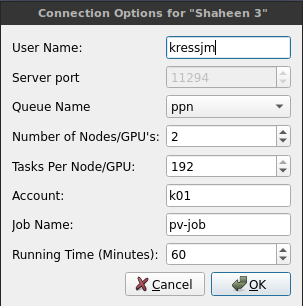
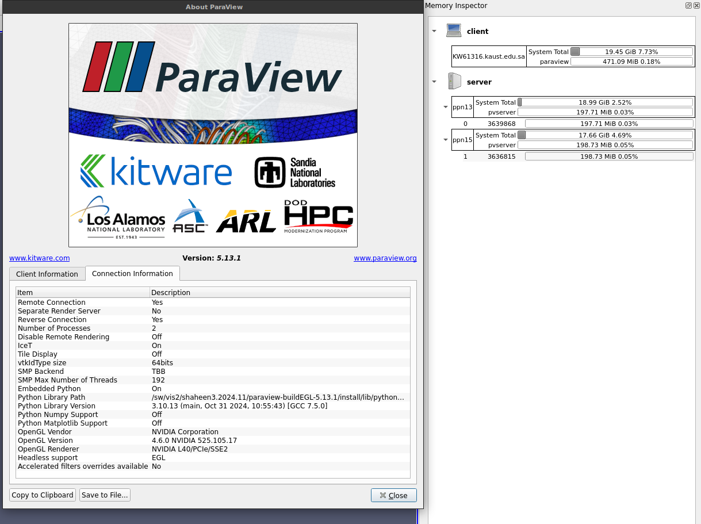

# ParaView_Vignettes

This guide is for the [ParaView_Vignettes Repository](https://gitlab.kitware.com/jameskress/KAUST_Visualization_Vignettes/-/tree/master/ParaView_Vignettes?ref_type=heads), which provides a collection of examples (vignettes) demonstrating how to use ParaView on KAUST's high-performance computing resources, including Ibex and Shaheen III. It covers running the examples and configuring ParaView for interactive use.

<br>

## What is ParaView?

ParaView is an open-source, multi-platform data analysis and visualization application. It allows users to quickly build visualizations to analyze their data using qualitative and quantitative techniques. Developed to handle extremely large datasets, ParaView excels at using distributed memory computing resources, making it ideal for use on HPC systems.

KAUST's Visualization Core Lab (KVL) provides ParaView server installations on Ibex and Shaheen to facilitate large-scale distributed visualizations, which can be run interactively through a GUI or non-interactively via batch scripts.

<br>

## Table of Contents
- [Getting Started: Running the Examples](#getting-started-running-the-examples)
- [In-Depth Guide: Using ParaView at KAUST](#in-depth-guide-using-paraview-at-kaust)
  - [1. Interactive Use (Client/Server Mode)](#1-interactive-use-clientserver-mode)
  - [2. Batch Processing Mode](#2-batch-processing-mode)
- [Repository Reference](#repository-reference)
- [Appendix: `pvbatch` vs. `pvpython`](#appendix-pvbatch-vs-pvpython)


<br>

## Getting Started: Running the Examples

This guide will walk you through cloning the repository and running one of the batch processing examples.

### 1. Clone the Repository

Log in to your target machine and clone this repository into your scratch space.

* **On Ibex:**
    ```bash
    ssh <username>@glogin.ibex.kaust.edu.sa
    cd /ibex/scratch/<username>/
    git clone https://gitlab.kitware.com/jameskress/KAUST_Visualization_Vignettes.git
    cd KAUST_Visualization_Vignettes/ParaView_Vignettes
    ```

* **On Shaheen III:**
    ```bash
    ssh <username>@shaheen.hpc.kaust.edu.sa
    cd /scratch/<username>/
    git clone https://gitlab.kitware.com/jameskress/KAUST_Visualization_Vignettes.git
    cd KAUST_Visualization_Vignettes/ParaView_Vignettes
    ```

### 2. Load the ParaView Module

Before running, you need to load the correct environment module. The `MODULES.sh` script handles this, but you can also do it manually:
```bash
module load paraview
```

### 3. Submit a Batch Job

The repository includes run scripts for each example.

* **On Ibex:**
    Submit the job using `sbatch`. For example, to run `ex01`:
    ```bash
    sbatch ex01/ex01_ibex_runScript.sbat
    ```

* **On Shaheen III:**
    First, you **must** edit the run script to include your project account. Replace `<##>` with your account ID.
    ```bash
    # Example for ex01
    vim ex01/ex01_shaheen_runScript.sbat
    # Change --account=<##> to your account, e.g., --account=k01
    ```
    Then, submit the job:
    ```bash
    sbatch ex01/ex01_shaheen_runScript.sbat
    ```

### 4. Check the Output

The output logs and any generated images will appear in the example's directory.
* Log files will be named like `ex01.ibex.<job_id>.out` or `ex01.shaheen_<job_id>.out`.
* You can view generated images on the command line using `display *.png`.

<br>

## In-Depth Guide: Using ParaView at KAUST

There are two primary ways to use ParaView: interactively with a GUI (client/server mode) or non-interactively via batch scripts.

### 1. Interactive Use (Client/Server Mode)

In this mode, the ParaView GUI runs on your local machine while the data processing and rendering happen on the powerful HPC resources.

#### **One-Time Setup**

You only need to do this once on your local computer.

1.  **Install ParaView:** Download and install the ParaView client from the [official ParaView website](https://www.paraview.org/download/).
    * **IMPORTANT:** The client version on your machine **must match** the version on the HPC system. Check the available versions on Ibex/Shaheen with `module avail paraview`.
    * **macOS Users:** You must install [XQuartz (X11)](https://www.xquartz.org/) to handle the authentication pop-up window.

2.  **Download Server Configuration Files:** Save the appropriate `.pvsc` file(s) to your computer.
    | System        | Configuration File Link                                                                                                 |
    |---------------|-------------------------------------------------------------------------------------------------------------------------|
    | **Ibex** | [ibex_server.pvsc](https://gitlab.kaust.edu.sa/kvl/paraview-configs/-/blob/master/pvsc/ibex/default_servers.pvsc)         |
    | **Shaheen III** | [shaheen_server.pvsc](https://gitlab.kaust.edu.sa/kvl/paraview-configs/-/blob/master/pvsc/ksl/default_servers.pvsc) |

3.  **Import Servers into ParaView:**
    * Open ParaView on your local machine.
    * Go to `File -> Connect...`.
    * Click `Load Servers` and select the `.pvsc` file(s) you just downloaded.

#### **Connecting to an HPC System**

After the one-time setup, follow these steps each time you want to start an interactive session.

1.  In ParaView, go to `File -> Connect...`.
2.  Select the server you want to connect to (e.g., `shaheen` or `ibex`) and click `Connect`.
3.  An options dialog will appear. Configure your job settings.
4.  After clicking `OK`, a terminal window (`xterm` or command prompt) will pop up. Enter your HPC password and DUO authentication code when prompted.
5.  Once your job starts, you will have control of the ParaView GUI again. You can now open files located on the remote HPC system and visualize them.

#### **Special Case: Using Shaheen III GPU Nodes**
For GPU-accelerated rendering, you can connect to the PPN (Pre and Post-Processing Node) partition.

**GPU Node Specifications:**
* **Cores:** 192
* **GPU:** 1 x NVIDIA L40
* **RAM:** ~768 GB

**Important Requirements & Limits:**
* **Group Membership:** You must be in the `video` Linux group to use the GPUs. If you are not, please [submit a ticket to HPC support](mailto:help@hpc.kaust.edu.sa) to be added.
* **Resource Allocation:** The PPN partition is a shared resource. Due to the QoS scheme, a single user cannot monopolize all nodes. It is strongly recommended to request only **1 node and 1 GPU** for your jobs.

**Connection Settings for a Shaheen GPU Node:**
When the connection dialog box appears, use these settings:
1.  **User Name:** Your KAUST username.
2.  **Queue Name:** Select `ppn`.
3.  **Number of Nodes/GPU's:** `1` (recommended), `2` (max).
4.  **Tasks Per Node/GPU:** `192` (to use all cores on the node).
5.  **Account:** Your project account.
6.  Click `OK` and proceed with authentication.



You can verify that the GPU is being used by checking `Help -> About`. The `OpenGL Renderer` should list the NVIDIA GPU (e.g., L40).



### 2. Batch Processing Mode

This mode is ideal for automated workflows, parameter sweeps, or generating animations without manual intervention. You write a Python script that ParaView executes on the cluster via a batch job.

* **How it Works:** You submit a job to the scheduler (Slurm) which runs `pvbatch` with your Python script (`.py`) as input.
* **Examples:** All the examples in this repository (`ex00` to `ex06`) are designed to be run in batch mode. See the "Getting Started" section above for instructions.

#### Creating a Python Script with Tracing
The easiest way to generate a Python script for batch processing is to perform the actions once in the interactive GUI and have ParaView automatically generate the code.

1.  Start an interactive session.
2.  In the GUI, go to `Tools -> Start Trace`. Keep the default settings and click `OK`.
3.  Perform all your visualization steps: open files, apply filters, change colors, set camera angles, etc.
4.  Once finished, go to `Tools -> Stop Trace`.
5.  ParaView will display the generated Python script. Save this script (`.py`) to be used with `pvbatch`.

<br>

## Repository Reference

### File Structure
Each example directory (`ex*`) contains:
-   `ex*.py`: The Python script that defines the ParaView visualization pipeline.
-   `ex*_shaheen_runScript.sbat`: The Slurm batch script for running the example on Shaheen III.
-   `ex*_ibex_runScript.sbat`: The Slurm batch script for running the example on Ibex.
-   `createParaViewMovie.sh`: A utility script to stitch generated PNG images into an MP4 movie using `ffmpeg`.

### Example Details
* `ex00`: Create a data source and query metadata (mesh info, variables).
* `ex01`: Create a data source, generate a screenshot, and save it to a file.
* `ex02`: Create an animation by moving the camera and capturing a series of screenshots.
* `ex03`: Animate iso surface values to visualize different segments of a static dataset.
* `ex04`: Animate the progression of streamlines in a vector field.
* `ex05`: Load a multi-timestep dataset and save one screenshot per step.
* `ex06`: A complex visualization pipeline for a large dataset.

<br>

## Appendix: `pvbatch` vs. `pvpython`

ParaView provides two Python interpreters. The key difference is how they are designed to run:

-   **`pvpython`**: A **serial** application. It's like the standard ParaView client but with a Python interpreter instead of a GUI. It can connect to a remote `pvserver` but runs itself on a single node. Best for interactive scripting on a login node.
-   **`pvbatch`**: A **parallel** MPI application. It is its own server and is designed to be launched with `srun` or `mpirun` across multiple nodes. This is the correct tool for large-scale, parallel batch processing.

**The examples in this repository all use `pvbatch` for scalable performance.**

For more details, see the official [ParaView Documentation](https://docs.paraview.org/en/latest/index.html).