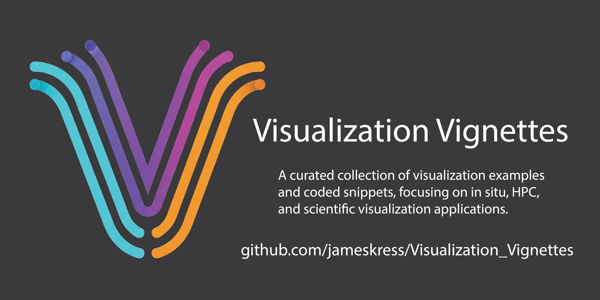

[](https://github.com/jameskress/Visualization_Vignettes/actions)
[](https://github.com/jameskress/Visualization_Vignettes/tags)

[](./Dockerfile)
[](https://github.com/jameskress/Visualization_Vignettes/pkgs/container/Visualization_Vignettes)

[](CONTRIBUTING.md)
[](CODE_OF_CONDUCT.md)

[](https://opensource.org/licenses/BSD-3-Clause)
[](./CITATION.cff)


# Visualization Vignettes
<p align="center">
  
</p>

Welcome to the **Visualization Vignettes** repository! This project is a "cookbook" of examples, best practices, and training materials for scientific and in situ visualization workflows, valuable for a global audience of researchers, students, and developers.

This repository is broadly divided into two sections:

1. A collection of stable **Visualization Tool Vignettes** for common tasks in ParaView and VisIt, often tailored for HPC environments.

2. An evolving section on **In Situ Processing**, centered on a "miniapp" that demonstrates co-processing with libraries like Ascent, Catalyst2, ADIOS2, and Kombyne. The detailed vignettes for this section are still under development.

## Table of Contents

* **General Documentation**

  * [Changelog](./CHANGELOG.md)

  * [Contribution Guidelines](./CONTRIBUTING.md)

  * [Code of Conduct](./CODE_OF_CONDUCT.md)

* **Visualization Tool Vignettes**

  * [**ParaView Vignettes**](./ParaView_Vignettes/README.md)

    * Details ParaView use on HPC systems (both batch and interactively), as well as local workflows.

  * [**VisIt Vignettes**](./VisIt_Vignettes/README.md)

    * Details VisIt use on HPC systems (both batch and interactively), as well as local workflows.

* **In Situ Processing Vignettes**

  * [**In Situ Overview**](./Miniapps/gray-scott/README.md)

* **Scripts**

  * Scripts that can help with visualization or movie making outside of ParaView or VisIt.

* **data**

  * data used the byt ParaView and VisIt Vignettes.

## Getting Started

There are two primary ways to use this repository, depending on your goals.

### 1. Exploring ParaView & VisIt Vignettes

These examples are designed to run on HPC or local systems and demonstrate common visualization tasks.

1. **Clone the repository:**
   `git clone https://github.com/jameskress/Visualization_Vignettes.git`

2. **Navigate to an example directory**, such as `./ParaView_Vignettes/`.

3. **Follow the specific `README.md`** in that directory for instructions.

### 2. Using the In Situ Miniapp with Docker

The in situ portion of this repo is centered around a "miniapp" that generates data and performs live visualization. A pre-built Docker image is automatically created by our CI/CD pipeline, providing a consistent and reproducible environment.

1. **Pull the latest Docker image from the registry:**
   `docker pull ghcr.io/jameskress/visualization_vignettes:latest`

2. **Create a local data directory:** The miniapp writes output files. Create a directory to mount into the container to persist this data on your local machine.
   `mkdir data`

3. **Run the container with a volume mount:** This command maps your new `data` directory to the `/app/data` directory inside the container. The `--rm` flag automatically cleans up and removes the container when you exit.
   `docker run -it --rm -v "${PWD}/data:/app/data" ghcr.io/jameskress/visualization_vignettes:latest`

4. From within the container, you can test the different in situ tools. Any produced images and data will be accessible in your local `data` directory.

5. For full details see: [**Running with Docker**](./Miniapps/gray-scott/README.md)

## How to Cite

If you use this repository for your research, publications, or projects, we kindly ask that you cite it. This helps us track the impact of our work and justify its continued development.

You can use the "Cite this repository" feature on the GitHub sidebar, which uses the included `CITATION.cff` file to generate formatted citations. For your convenience, here is a BibTeX entry you can copy directly:

```bibtex
@software{Kress_Visualization_Vignettes_2025,
  author = {Kress, James},
  title = {{Visualization Vignettes}},
  month = {9},
  year = {2025},
  publisher = {GitHub},
  version = {0.1.0},
  url = {[https://github.com/jameskress/Visualization_Vignettes](https://github.com/jameskress/Visualization_Vignettes)}
}
```

## Contributing

We welcome contributions from the global community! If you have a new example, a bug fix, or a suggestion, please read our [Contribution Guidelines](./CONTRIBUTING.md).

## License

This project is licensed under the BSD 3-Clause License. See the [LICENSE](./LICENSE) file for details.